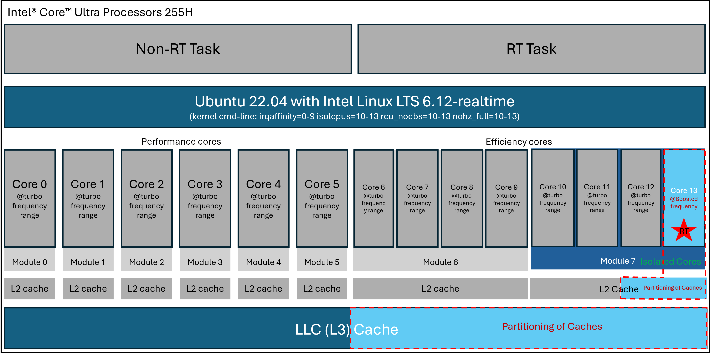
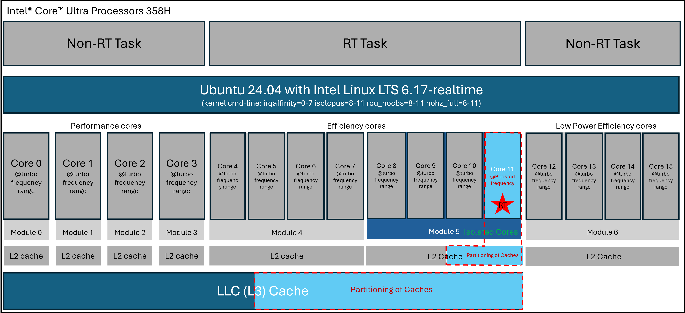

# Real-Time Linux

The Embodied Intelligence SDK provides real-time capabilities to the kernel with PREEMPT_RT patch and boot parameters for real-time optimization, which aims to increase predictability and reduce scheduler latencies.

## Automated Installation

You can automate the software setup flow on this page with:

[rt_linux_setup.sh](https://github.com/open-edge-platform/edge-ai-suites/blob/main/robotics-ai-suite/docs/embodied/get-started/installation/rt_linux_setup.sh)

Default real-time kernel setup (includes OS setup prerequisites: download [os_setup_install.sh](https://github.com/open-edge-platform/edge-ai-suites/blob/main/robotics-ai-suite/docs/embodied/get-started/prerequisites/os_setup_install.sh) and place in the same directory before running rt_linux_setup.sh):

```bash
sudo -E ./rt_linux_setup.sh
```

Skip OS setup prerequisites (run RT setup steps only: os_setup_install.sh not needed):

```bash
sudo -E ./rt_linux_setup.sh --skip-os-setup
```

Real-time setup with GRUB tuning and runtime options:

```bash
sudo -E ./rt_linux_setup.sh --apply-rt-grub-tuning --disable-timer-migration --disable-swap --stop-unnecessary-services --disable-cstate-cpus 13-13
```

For all available options:

```bash
./rt_linux_setup.sh --help
```

When using the automated script, it logs which sections from this page are skipped for the selected options.

The following three sections are always skipped because they require manual, platform-specific actions:

- `Select [Experimental] ECI Ubuntu` boot entry after reboot
- `Use Cache Allocation Technology`
- `Use Dynamic Voltage and Frequency`

## Manual Installation

1. Install GRUB customizations

   ```bash
   sudo apt install -y customizations-grub
   ```

2. Install linux-firmware

   ```bash
   sudo apt install -y linux-firmware
   ```

   > **Note:** Linux kernel version 6.12 requires specific Intel® Graphics Driver graphics microcontroller (guc), display microcontroller (dmc), and Intel® Graphics System Controller (Intel® GSC) (gsc) firmwares; these firmwares are installed in `/lib/firmware/i915/experimental/`. Confirm the following boot parameters through `cat /proc/cmdline` after the next reboot:
   >
   > ```bash
   > i915.guc_firmware_path=i915/experimental/mtl_guc_70.bin i915.dmc_firmware_path=i915/experimental/mtl_dmc.bin i915.gsc_firmware_path=i915/experimental/mtl_gsc_1.bin
   > ```
   > 
   > If you cannot find the firmwares in `/lib/firmware/i915/experimental/`, install the latest `linux-firmware`:
   > 
   > ```bash
   > sudo apt install -y linux-firmware=20220329.git681281e4-0ubuntu3.36-intel-iotg.eci8
   > ```
   > 
   > You can double check if the correct linux-firmware is in use:
   > 
   > ```bash
   > sudo apt-cache policy linux-firmware
   > ```
   > 
   > Expected result:
   > 
   > ```console
   > linux-firmware:
   >   Installed: 20220329.git681281e4-0ubuntu3.36-intel-iotg.eci8
   > ```

4. Install the real-time Linux kernel. For details, see [LinuxBSP](../../packages/linuxbsp.md).

   ```bash
   sudo apt install -y linux-intel-rt-experimental
   ```

   **Note:** If you don't need to use RT kernel, install with the following command:

   ```bash
   sudo apt install -y linux-intel-experimental
   ```

5. To modify default boot parameters, edit `/etc/grub.d/10_eci_experimental`.

   **Note:** Modify `eci_cmdline_exp` in `/etc/grub.d/10_eci_experimental` for a better real-time performance and power consumption:

   <!--hide_directive::::{tab-set}hide_directive-->
   <!--hide_directive:::{tab-item}hide_directive--> **Ubuntu 22.04**
   <!--hide_directive:sync: humblehide_directive-->

   ```bash
   # Modify default cmdline parameters to enable cstate/pstate
   sudo sed -i 's/intel_pstate=disable intel.max_cstate=0 intel_idle.max_cstate=0 processor.max_cstate=0 processor_idle.max_cstate=0/intel_pstate=enable/g' /etc/grub.d/10_eci_experimental
   # Modify default cmdline parameter to affinity irq to core 0-9
   sudo sed -i 's/irqaffinity=0 /irqaffinity=0-9 /g' /etc/grub.d/10_eci_experimental
   # Modify default cmdline parameter to isolate cpus to core 10-13
   sudo sed -i 's/isolcpus=[^ ]* rcu_nocbs=[^ ]* nohz_full=[^ ]*/isolcpus=10-13 rcu_nocbs=10-13 nohz_full=10-13/g' /etc/grub.d/10_eci_experimental
   # Modify default cmdline parameter to set efi=noruntime
   sudo sed -i 's/efi=[^ ]*/efi=noruntime/g' /etc/grub.d/10_eci_experimental
   # Modify default cmdline parameter to set iommu to passthrough mode
   sudo sed -i '/^eci_cmdline_exp=/ s/"$/ iommu=pt"/' /etc/grub.d/10_eci_experimental
   sudo update-grub
   ```
   
   <!--hide_directive:::hide_directive-->
   <!--hide_directive:::{tab-item}hide_directive--> **Ubuntu 24.04**
   <!--hide_directive:sync: jazzyhide_directive-->

   ```bash
   # Modify default cmdline parameters to enable cstate/pstate
   sudo sed -i 's/intel_pstate=disable intel.max_cstate=0 intel_idle.max_cstate=0 processor.max_cstate=0 processor_idle.max_cstate=0/intel_pstate=enable/g' /etc/grub.d/10_eci_experimental
   # Modify default cmdline parameter to affinity irq to core 0-7
   sudo sed -i 's/irqaffinity=0 /irqaffinity=0-7 /g' /etc/grub.d/10_eci_experimental
   # Modify default cmdline parameter to isolate cpus to core 8-11
   sudo sed -i 's/isolcpus=[^ ]* rcu_nocbs=[^ ]* nohz_full=[^ ]*/isolcpus=8-11 rcu_nocbs=8-11 nohz_full=8-11/g' /etc/grub.d/10_eci_experimental
   # Modify default cmdline parameter to set efi=noruntime
   sudo sed -i 's/efi=[^ ]*/efi=noruntime/g' /etc/grub.d/10_eci_experimental
   # Kernel parameters need to load the correct Xe firmware
   sudo sed -i '/^eci_cmdline_exp=/ s/i915\.[^ ]*[[:space:]]*//g' /etc/grub.d/10_eci_experimental
   sudo sed -i '/^eci_cmdline_exp=/ s/xe\.force_probe/modprobe.blacklist=i915 xe.force_probe/' /etc/grub.d/10_eci_experimental
   sudo sed -i '/^eci_cmdline_exp=/ s/"$/ udmabuf.list_limit=8192 "/' /etc/grub.d/10_eci_experimental
   # Modify default cmdline parameter to set iommu to passthrough mode
   sudo sed -i '/^eci_cmdline_exp=/ s/"$/ iommu=pt "/' /etc/grub.d/10_eci_experimental

   sudo update-grub
   ```

   <!--hide_directive:::hide_directive-->
   <!--hide_directive::::hide_directive-->

   The following command line parameters are used for real-time optimization. You can modify them according to your requirements:

   - `isolcpus`: Isolates specified CPU cores from the generic scheduler, dedicating them to real-time tasks.
   - `rcu_nocbs`: Prevents specified CPU cores from handling RCU (Real-Copy-Update) callback, reducing latency.
   - `nohz_full`: Enables full dynamic ticks on specified CPU cores, reducing timer interrupts.
   - `irqaffinity`: Directs all hardware interrupts to specified CPU cores, keeping them free for real-time tasks.

4. Select `[Experimental] ECI Ubuntu` booting after rebooting.

   

   <!--hide_directive::::{tab-set}hide_directive-->
   <!--hide_directive:::{tab-item}hide_directive--> **Ubuntu 22.04**
   <!--hide_directive:sync: humblehide_directive-->

   **Note:** Select `Advanced Options for [Experimental] ECI Ubuntu` to list `[Experimental] ECI Ubuntu, with Linux 6.12.8-intel-ese-experimental-lts-rt` for a real-time kernel or `[Experimental] ECI Ubuntu, with Linux 6.12.8-intel-ese-experimental-lts` for a generic kernel.

   

   <!--hide_directive:::hide_directive-->
   <!--hide_directive:::{tab-item}hide_directive--> **Ubuntu 24.04**
   <!--hide_directive:sync: jazzyhide_directive-->

   **Note:** Select `Advanced Options for [Experimental] ECI Ubuntu` to list `[Experimental] ECI Ubuntu, with Linux 6.17.11-intel-ese-experimental-lts-rt` for a real-time kernel or `[Experimental] ECI Ubuntu, with Linux 6.17.11-intel-ese-experimental-lts` for a generic kernel.

   

   <!--hide_directive:::hide_directive-->
   <!--hide_directive::::hide_directive-->

## Real-time Runtime Optimization

To achieve real-time performance on a target system, specific runtime configurations and optimizations are recommended. This section provides a foundation for enabling real-time capable workloads.

<!--hide_directive::::{tab-set}hide_directive-->
<!--hide_directive:::{tab-item}hide_directive--> **Ubuntu 22.04**
<!--hide_directive:sync: humblehide_directive-->



<!--hide_directive:::hide_directive-->
<!--hide_directive:::{tab-item}hide_directive--> **Ubuntu 24.04**
<!--hide_directive:sync: jazzyhide_directive-->



<!--hide_directive:::hide_directive-->
<!--hide_directive::::hide_directive-->

### Use Cache Allocation Technology

Intel® Cache Allocation Technology (CAT) enables partitioning of caches at various levels within the caching hierarchy, providing a straightforward method to enhance temporal isolation between real-time and best-effort workloads.

This is an example configuration should be tailored to your specific use case and processor. To determine cache topology, including size and number of ways supported by a processor, use the CPUID leaf "Deterministic Cache Parameters Leaf - 0x4". Linux utilities link `lstopo` are also useful for obtaining an overview of a processor's cache topology.

For more information about CAT, refer to the following resources:

- Public Intel® Time Coordinated Computing (TCC) User Guide - [RDC #[831067]](https://cdrdv2-public.intel.com/851159/Public%20TCC%20User%20Guide%20-%20Q4%202025%20-%20RDC-831067.pdf)
- Intel® Resource Director Technology (Intel® RDT) Architecture Specification - [RDC #[789566]](https://cdrdv2-public.intel.com/851356/356688-004-intel-rdt-architecture-spec.pdf)
- Intel® 64 and IA-32 Architectures Software Developer's Manual - [RDC #[671200]](https://cdrdv2-public.intel.com/874240/325462-090-sdm-vol-1-2abcd-3abcd-4.pdf)

Below is an example script to partition the Last Level Cache (LLC) and L2 Cache, assigning an exclusive portion to real-time tasks. Ensure you have installed the Linux `msr-tools` to test it according to your configuration:

<!--hide_directive::::{tab-set}hide_directive-->
<!--hide_directive:::{tab-item}hide_directive--> **Ubuntu 22.04**
<!--hide_directive:sync: humblehide_directive-->

(e.g. core 13 as isolated core)

```bash
# ! /bin/sh
# define LLC Core Masks
wrmsr 0xc90 0x3f          # best effort mask
wrmsr 0xc91 0xfc0         # real-time mask

# define E-core L2 Core Mask
wrmsr -p10 0xd10 0xff     # best effort mask
wrmsr -p11 0xd10 0xff     # best effort mask
wrmsr -p12 0xd10 0xff     # best effort mask
wrmsr -p13 0xd11 0xff00   # real-time mask

# assign the masks to the cores
# This has to match with the core selected for the real-time task
wrmsr -p13 0xc8f 0x100000000
```

<!--hide_directive:::hide_directive-->
<!--hide_directive:::{tab-item}hide_directive--> **Ubuntu 24.04**
<!--hide_directive:sync: jazzyhide_directive-->


(e.g. core 11 as isolated core)

```bash
# ! /bin/sh
# define LLC Core Masks
wrmsr 0xc90 0x3f          # best effort mask
wrmsr 0xc91 0xfc0         # real-time mask

# define E-core L2 Core Mask
wrmsr -p8 0xd10 0xff     # best effort mask
wrmsr -p9 0xd10 0xff     # best effort mask
wrmsr -p10 0xd10 0xff     # best effort mask
wrmsr -p11 0xd11 0xff00   # real-time mask

# assign the masks to the cores
# This has to match with the core selected for the real-time task
wrmsr -p11 0xc8f 0x100000000
```

<!--hide_directive:::hide_directive-->
<!--hide_directive::::hide_directive-->

### Use Dynamic Voltage and Frequency

Dynamic Voltage and Frequency Scaling (DVFS) features, such as Intel® Speed Step, Speed Shift, and Turbo Boost Technology, allow processors to adjust voltage and frequency within P-States to balance power efficiency and performance. Speed Step and Speed Shift manage these adjustments, while Turbo Boost temporarily exceeds the highest P-State for additional performance during demanding task.

To enhance single-thread performance, boost the frequency of the real-time core within the turbo frequency range. For real-time requirements, you can lock the core frequency during runtime using HWP MSRs or the `intel_pstate` driver in Linux. Locking the core frequency of the real-time application to a turbo frequency and limiting the maximum frequency of best-effort (BE) cores to the base frequency, as guided by the TCC User Guide, results in reduced execution time jitter and significantly lower execution time.

Boost the frequency of the real-time core to a value within the turbo frequency range to leverage higher single-thread performance. As real-time requirements, you have the option to lock core frequency during runtime using the HWP MSRs or the `intel_pstate` driver under Linux.

For more information on accessing HWP MSRs directly instead of using the `sysfs` entries of the `intel_pstate` driver, refer to the [[TCC User Guide]](https://cdrdv2.intel.com/v1/dl/getContent/831067) and the Intel® 64 and the Intel® 64 and IA-32 Architectures Software Developer's Manual Vol3 section "Power and Thermal Management-Hardware Controlled Performance States - [RDC #[671200]](https://cdrdv2.intel.com/v1/dl/getContent/671200).

> **Attention:** Setting even just a few cores to a higher, fixed frequency does not come without a cost. Due to higher internal frequency, voltages, and subsequent higher temperature and power, such settings will negatively impact the reliability expectations of the CPU and should be used with careful consideration.

Below is an example to boost the real-time core to 3GHz, with the Energy Performance Preference (EPP) set to performance to ensure Quality of Service (QoS) in case of power limit throttling:

<!--hide_directive::::{tab-set}hide_directive-->
<!--hide_directive:::{tab-item}hide_directive--> **Ubuntu 22.04**
<!--hide_directive:sync: humblehide_directive-->

(e.g. core 13 as isolated core on Intel® Core™ Ultra Processors 255H)

- (Option 1): Using the `sysfs` entries of the `intel_pstate` driver

  ```bash
  # ! /bin/sh
  # Set the min and max frequencies to specific turbo frequency
  echo performance >  /sys/devices/system/cpu/cpu13/cpufreq/scaling_governor
  echo 3000000 >  /sys/devices/system/cpu/cpu13/cpufreq/scaling_max_freq
  echo 3000000 >  /sys/devices/system/cpu/cpu13/cpufreq/scaling_min_freq
  ```

- (Option 2): Using `msr-tools` to modify `IA32_HWP_REQUEST(0x774)` for setting specific core frequency.

  **Note:** For details on `IA32_HWP_REQUEST`, please refer to the Intel® 64 and the Intel® 64 and IA-32 Architectures Software Developer's Manual Vol3 section "Power and Thermal Management-Hardware Controlled Performance States - [RDC #[671200]](https://cdrdv2.intel.com/v1/dl/getContent/671200).

  ```bash
  # ! /bin/sh
  wrmsr 0x774 -p 0 0x80005201
  wrmsr 0x774 -p 1 0x80005201
  wrmsr 0x774 -p 2 0x80005201
  wrmsr 0x774 -p 3 0x80005201
  wrmsr 0x774 -p 4 0x80005201
  wrmsr 0x774 -p 5 0x80005201
  wrmsr 0x774 -p 6 0x80003e01
  wrmsr 0x774 -p 7 0x80003e01
  wrmsr 0x774 -p 8 0x80003e01
  wrmsr 0x774 -p 9 0x80003e01
  wrmsr 0x774 -p 10 0x00002a2a
  wrmsr 0x774 -p 11 0x00002a2a
  wrmsr 0x774 -p 12 0x00002a2a
  wrmsr 0x774 -p 13 0x00002a2a
  ```

<!--hide_directive:::hide_directive-->
<!--hide_directive:::{tab-item}hide_directive--> **Ubuntu 24.04**
<!--hide_directive:sync: jazzyhide_directive-->

(e.g. core 11 as isolated core on Intel® Core™ Ultra Processors 358H)

- (Option 1): Using the `sysfs` entries of the `intel_pstate` driver

  ```bash
  # ! /bin/sh
  # Set the min and max frequencies to specific turbo frequency
  echo performance >  /sys/devices/system/cpu/cpu11/cpufreq/scaling_governor
  echo 3000000 >  /sys/devices/system/cpu/cpu11/cpufreq/scaling_max_freq
  echo 3000000 >  /sys/devices/system/cpu/cpu11/cpufreq/scaling_min_freq
  ```

- (Option 2): Using `msr-tools` to modify `IA32_HWP_REQUEST(0x774)` for setting specific core frequency.

  **Note:** For details on `IA32_HWP_REQUEST`, please refer to the Intel® 64 and the Intel® 64 and IA-32 Architectures Software Developer's Manual Vol3 section "Power and Thermal Management-Hardware Controlled Performance States - [RDC #[671200]](https://cdrdv2.intel.com/v1/dl/getContent/671200).

  ```bash
  # ! /bin/sh
  wrmsr 0x774 -p 0 0x80003501
  wrmsr 0x774 -p 1 0x80003501
  wrmsr 0x774 -p 2 0x80003501
  wrmsr 0x774 -p 3 0x80003501
  wrmsr 0x774 -p 4 0x80002501
  wrmsr 0x774 -p 5 0x80002501
  wrmsr 0x774 -p 6 0x80002501
  wrmsr 0x774 -p 7 0x80002501
  wrmsr 0x774 -p 8 0x00002020
  wrmsr 0x774 -p 9 0x00002020
  wrmsr 0x774 -p 10 0x00002020
  wrmsr 0x774 -p 11 0x00002020
  wrmsr 0x774 -p 12 0x80002101
  wrmsr 0x774 -p 13 0x80002101
  wrmsr 0x774 -p 14 0x80002101
  wrmsr 0x774 -p 15 0x80002101
  ```

<!--hide_directive:::hide_directive-->
<!--hide_directive::::hide_directive-->

> **Attention:** On current Intel platforms the P-state of performance (P) cores can be selected independently per core. Efficiency (E) cores are typically grouped in sets of four cores per module and the P-state can be selected per module.

### Per-core C-State Disable

Refer to [OS Setup](../prerequisites/os_setup.md) for BIOS optimization and Linux boot parameter optimization on real-time performance, Intel C-state and P-state are enabled. It brings more power consumption to improve on GPU AI performance, but C-state can introduce jitter due to the varying times required to transition between states in isolated cores. **Per-core C-state Disable** helps minimize this jitter, providing a more stable environment for real-time task.

Follow with below command to disable C-state in isolated core:

(e.g. core 13 as isolated core)

```bash
# ! /bin/sh
# Disable all cstates except C0 in isolated CPU cores
# Define the range for CPU indices
cpu_start=13  # Replace with your starting CPU index
cpu_end=13   # Replace with your ending CPU index

# Loop over each CPU index
for (( i=cpu_start; i<=cpu_end; i++ )); do
    # Determine the maximum state index for the current CPU
    max_state_index=$(ls /sys/devices/system/cpu/cpu$i/cpuidle/ | grep -o 'state[0-9]*' | sed 's/state//' | sort -n | tail -1)

    # Loop over each state index
    for (( j=1; j<=max_state_index; j++ )); do
        # Disable the current state
        sudo echo 1 > /sys/devices/system/cpu/cpu$i/cpuidle/state$j/disable
        echo "Disabled CPU $i state $j"
    done
done
```

> **Note:** Combine the adjustment of P-states, C-states and Turbo-Boost. Use `cpupower` tool (manually build cpupower from kernel source code, see [LinuxBSP](../../packages/linuxbsp.md#cpupower)) to configure isolated cores in following way:
> 1. Set minimum and maximum frequency to specific turbo frequency.
> 2. Set Governor to performance.
> 3. Disable C-states other than C0 or Poll.
>
> By following those steps, configuration will look like this:
> 
>

### Timer Migration Disable

In Linux kernel, timer migration refers to the process of moving timers from one CPU to another. This is often done to balance the load across CPUs or to optimize power management by consolidating timers on fewer CPUs when others are idle. Timer migration can lead to interference with other tasks running on the target CPU, potentially affecting real-time performance in isolated CPU core. By keeping timers on their original CPU, you minimize the risk of such interference.

Disabling timer migration in a real-time kernel helps maintain the consistency and predictability required for real-time applications, ensuring that timers are executed with minimal latency and interference.

Timer migration can be disabled with the following command:

```bash
echo 0 > /proc/sys/kernel/timer_migration
```

### Disable Swap

Accessing anonymous memory that has been swapped to disk results in a major page fault. Handling page faults can further increase latency and unpredictability, which is undesirable in real-time tasks.
Swap can be disabled with following command:

```bash
swapoff -a
```
### Stop Unnecessary Services

On Linux, by default, many services run in the background. Stopping services may reduce spurious interrupts depending on the workload type. To list the loaded services, run the following command:

```bash
systemctl -t service
```

To stop a service, run the following command (where \<service\> is the name a service):

> **Warning:** Stopping system services can be detrimental to the stability of the Linux system. Be sure you understand the implications before stopping a service. e.g.

```bash
#systemctl stop <service>
systemctl stop fwupd-refresh.timer fwupd.service snapd.socket snapd.service
```

### Prevent integrated graphics from changing power states

The Intel integrated graphics engine manages power and frequency, which impacts latency for real-time workloads. 

Intel® Graphics Render Standby Technology (Intel® GRST), RC6, or RC6+ adjusts the integrated graphics engine's voltage very low, or close to zero, when the system is asleep. In some cases, RC6 has caused latency spikes in real-time workloads. Therefore, RC6 should be disabled to improve real-time performance.

<!--hide_directive::::{tab-set}hide_directive-->
<!--hide_directive:::{tab-item}hide_directive--> **i915**

Because of the way the Linux i915 graphics driver handles RC6, this feature must be disabled in both the BIOS and in the i915 Linux graphics driver. Refer to Table 5, which describes RC6 disabling in the BIOS. The Linux command-line interface command used to disable RC6 are shown below:

```bash
cat /proc/cmdline | grep rc6
i915.enable_rc6=0
```

```bash
echo 0 > /sys/class/drm/card0/gt_rc6_enable
```

<!--hide_directive:::hide_directive-->
<!--hide_directive:::{tab-item}hide_directive-->  **Xe**

As the Xe driver does not support disabling RC6, there is no parameter for it. Try below methods to hold forcewake so that GT will always ON. Keep the debugfs file descriptor by letting a long‑lived shell process hold it open. Either method works as follows (replace PATH with the real forcewake_all path, e.g., /sys/kernel/debug/dri/0/forcewake_all):

1. Open FD in current shell and keep it:

   ```bash
   exec 3< /sys/kernel/debug/dri/0/forcewake_all
   # FD 3 now holds it; forcewake stays asserted until released
   exec 3<&-
   ```

2. Background sleeper holding it:

   ```bash
   sleep 999999 < /sys/kernel/debug/dri/0/forcewake_all &
   # Kill the sleep to release
   kill -9 pid 
   ```

<!--hide_directive:::hide_directive-->
<!--hide_directive::::hide_directive-->

## Verify Benchmark Performance

After installing the real-time Linux kernel, it is a good idea to benchmark the system to confirm that the system is properly configured. Perform either of the following commands to install [Cyclictest](https://git.kernel.org/pub/scm/utils/rt-tests/rt-tests.git). Cyclictest is most commonly used for benchmarking real-time systems. It is one of the most frequently used tools for evaluating the relative performance of an RT. Cyclictest accurately and repeatedly measures the difference between a thread's intended wake-up time and the time at which it actually wakes up to provide statistics about the system's latency. It can measure latency in real-time systems caused by the hardware, the firmware, and the operating system.
Please use `rt-tests v2.6` to collect performance, which support pinning threads to a specific isolated core and avoid the main thread in the core with the measurement threads.

Follow with below steps, you can find `cyclictest v2.6` in `rt-tests-2.6`:

```bash
wget https://web.git.kernel.org/pub/scm/utils/rt-tests/rt-tests.git/snapshot/rt-tests-2.6.tar.gz
tar zxvf rt-tests-2.6.tar.gz
cd rt-tests-2.6
make
```

**Note**: Please ensure you had installed `libnuma-dev` as dependence before compilation.

```bash
sudo apt install libnuma-dev
```

An example command that runs the cyclictest benchmark as below (core 13 as isolated core):

```bash
cyclictest -mp 99 -t1 -a 13 -i 1000 --laptop -D 72h  -N --mainaffinity 12
```

Default parameters are used unless otherwise specified. Run `cyclictest --help` to list the modifiable arguments.

| Option | Explanation |
|--------|-------------|
| `-p` | priority of highest priority thread |
| `-t` | one thread per available processor |
| `-a` | Run thread #N on processor #N, or if CPUSET given, pin threads to that set of processors in round-robin order |
| `-i` | base interval of thread in us default=1000 |
| `-D` | specify a length for the test run |
| `-N` | print results in ns instead of us (default us) |
| `--mainaffinity` | Run the main thread on CPU #N. This only affects the main thread and not the measurement threads |
| `-m` | lock current and future memory allocations |
| `--laptop` | Not setting `cpu_dma_latency` to save battery, recommend using it when enabling per-core C-state disable. |

On a **realtime-enabled** system, the result might be similar to the following:

```console
T: 0 ( 3407) P:99 I:1000 C: 100000 Min:      928 Act:   1376 Avg:   1154 Max:      18373
```

This result indicates an apparent short-term worst-case latency of 18 us. According to this, it is important to pay attention to the Max values as these are indicators of outliers. Even if the system has decent Avg (average) values, a single outlier as indicated by Max is enough to break or disturb a real-time system.

If the real-time data is not good by default installation, please refer to [OS Setup](../prerequisites/os_setup.md) for BIOS optimization and [Optimize Performance](https://eci.intel.com/docs/3.3/development/performance.html) to optimize Linux OS and application runtime on Intel® Processors.
